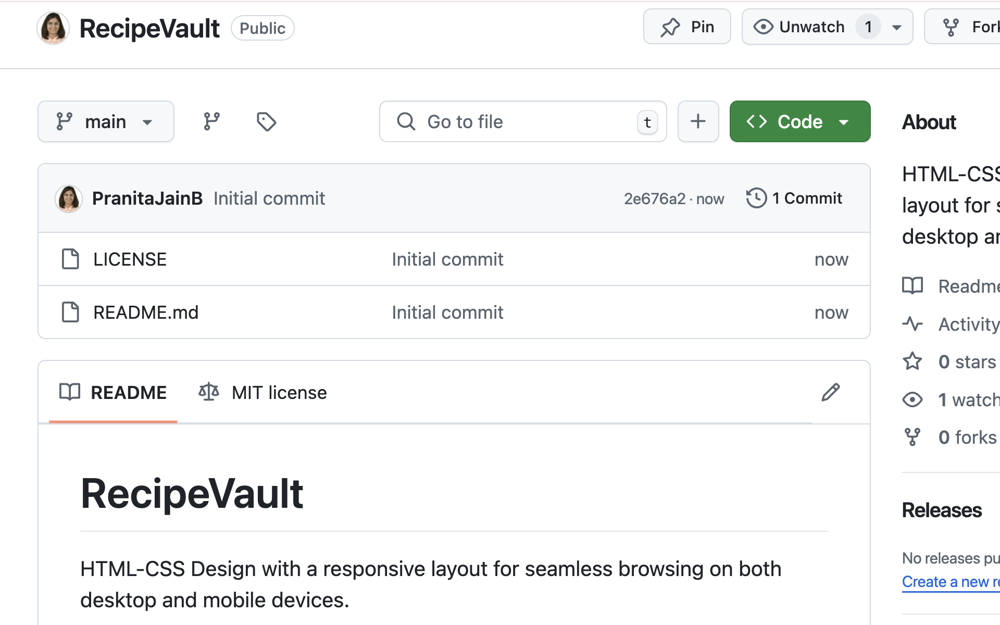

# RecipeVault

HTML-CSS  Design with a responsive layout for seamless browsing on both desktop and mobile devices.


Learnings in this project are as follows -


# **how do I paste image in readme.md file from VS code editor**

* To include an image in your `README.md` file from VS Code, follow these steps:

  ### 1. **Add the Image to Your Project Folder**
  * Place the image file in your project directory (e.g., in an `assets` or `images` folder).

  ### 2. **Reference the Image in** `README.md`
  * Use Markdown syntax to link the image. For example:

    ```markdown
    
    ```
  * Replace `relative/path/to/image.png` with the relative path to your image file from the location of your `README.md` file.
  * BUT MOST IMPORTANTLY YOU SHOULD TYPE IT IN CODE FILE , THEN PASTE IT ON README FILE , BECAUSE IT’S NOT EASY TO EDIT ABOVE CODE IN README . ALSO TO SEE CHANGES GOTO README FILE IN FOLDER AND RIGHT CLICK AND SELECT PREVIEW OPTION.

  Example:

  ```markdown
  
  ```

  ### 3. **Paste Image Directly into VS Code**
  * If you have an image copied to your clipboard, you can use an extension like **"Paste Image"** in VS Code:

    
    1. Install the [Paste Image](https://marketplace.visualstudio.com/items?itemName=mushanshitiancai.vscode-paste-image) extension.
    2. In your `README.md`, position the cursor where you want the image reference.
    3. Paste the image (`Ctrl+V` or `Cmd+V`).
    4. The extension will save the image to a predefined folder (e.g., `images`) and automatically insert the Markdown syntax for the image.

  ### 4. **Preview the Markdown**
  * Right-click in your `README.md` file and select **"Open Preview"** or press `Ctrl+Shift+V` (Windows/Linux) or `Cmd+Shift+V` (Mac) to see how the image appears.

  Let me know if you need more help!


# How to create a new repository for any new project

 

 


1. Clone this git CODE in vs code . you will see that you are working on main branch .
2. to be more practical in git , create a branch inside git and work on these branches , and keep on merging the code in the main branch. again always create a branch from main only.

# Why we often set `box-sizing: border-box ?`

### Default Behavior (`content-box`)

By default, the `box-sizing` property is set to `content-box`. In this mode:

* The **width** and **height** of an element only include the content.
* Padding and borders are added **outside** the specified width and height, which can cause elements to grow unexpectedly.

For example:

```css
div {
  width: 200px; /* Only content width */
  padding: 20px; /* Adds 40px total */
  border: 10px solid black; /* Adds 20px total */
}
```

The element's total width becomes **260px** (200 + 40 + 20), which can make layout calculations tricky.


### Using `border-box`

When `box-sizing: border-box` is applied:

* The **width** and **height** include content, padding, and borders.
* This means the element’s total size stays consistent with the width and height you specify.

For the same example:

```css
div {
  box-sizing: border-box;
  width: 200px; /* Includes content, padding, and border */
  padding: 20px;
  border: 10px solid black;
}
```

The total width remains **200px**, making it much easier to manage layouts.


### Benefits of `border-box`


1. **Predictable Layouts**: The size you set is the size you get, which reduces unexpected overflow and makes layout planning straightforward.


# Why do we always set `min-height: 100vh` and `width: 100%`


### Why `min-height: 100vh`?


1. **Viewport Relative Units for Height (**`100vh`):
   * `100vh` ensures the element’s height covers the **entire height of the viewport**, regardless of its content.
   * Using `min-height` allows the element to expand if its content exceeds the viewport height.
2. **Dynamic Content**:
   * For many layouts, vertical scrolling is more common. Using `min-height` ensures the container grows as needed for additional content.


### Why `width: 100%`?


1. **Percentage Units for Width (**`100%`):
   * `width: 100%` ensures the element stretches across the entire width of its parent or the viewport.
   * This works well because, unlike height, the content in most layouts naturally expands horizontally, so a **minimum width** isn't as important.
2. **No Horizontal Overflow by Default**:
   * Content doesn’t typically overflow horizontally (due to how text wraps), so `min-width` isn’t commonly needed in most layouts.


### Why Not Use `height: 100vh` or `min-width: 100vh`?


1. `height: 100vh`:
   * If you set `height: 100vh`, the element's height becomes **fixed** at the viewport height, even if the content overflows. This can cause issues where content gets **cut off** and scrolling is disabled unintentionally.
2. `min-width: 100vh`:
   * `vh` is a **vertical unit** and has no direct relation to the width of the viewport. Using `min-width: 100vh` can lead to unpredictable results because it bases the width on the height of the viewport instead of the width.


### Why Not Use `width: 100%` and `height: 100%` Together?


1. **Behavior of \`% Units**:
   * `width: 100%` works fine because it stretches the element to match its parent’s width (usually the viewport width).
   * `height: 100%`, however, depends on the **height of the parent**. If the parent doesn’t have a fixed height or a height defined, the element with `height: 100%` might collapse to `0` because percentages need a reference point.

   **Example of collapsing height**:

   ```css
   body, html {
     width: 100%;
   }
   
   div {
     width: 100%;
     height: 100%; /* May collapse without a defined parent height */
   }
   ```
2. **Viewport Units Are More Reliable for Height**:
   * `100vh` is absolute and always represents the viewport height, while `100%` depends on the parent element’s height.


# If `height: 100%` depends on the parent’s height and collapses to 0 when the parent has no fixed height, why does `width: 100%` work on the `<body>` tag even when the parent’s width isn’t explicitly defined?

Ah, great observation! The reason `width: 100%` works on the `<body>` tag (or similar elements) without explicitly setting the parent’s width, while `height: 100%` often fails, lies in **how browsers handle width and height differently by default**. Let’s dive into the explanation.


### 1. **Default Behavior of** `html` and `body` Elements

* **Width**: The `<html>` and `<body>` elements automatically stretch their width to fill the entire viewport width (even without explicitly setting `width`).
  * By default, the browser makes the `<html>` and `<body>` elements **block-level elements**, which naturally expand to match the width of their containing block (in this case, the viewport).
  * Therefore, `width: 100%` on the `<body>` simply means "take 100% of the already stretched width of the viewport."
* **Height**: The `<html>` and `<body>` elements **do not automatically stretch their height** to match the viewport unless explicitly set.
  * If no height is specified for `<html>` or `<body>`, their height is determined by the content inside. If the content is smaller than the viewport, their height collapses to the size of the content.
  * This means `height: 100%` won’t work properly unless the height of the parent (`<html>` or `<body>`) is explicitly defined (e.g., `height: 100vh` or `height: 100%` on `<html>`).


### 2. **Why** `width: 100%` Works Without a Set Parent Width

* **Width Cascades by Default**: Browsers treat the width of the `<html>` element as 100% of the viewport width by default. When you apply `width: 100%` to the `<body>` or its child elements, it simply inherits this width from the `<html>` element, which is already stretched to the full viewport width.
  * Even without explicitly setting `width: 100%` on `<html>`, it behaves as though `width: 100%` is applied because browsers assume that layout fills the viewport horizontally.
  * **Illustration**:

    ```css
    html, body {
      /* No width explicitly defined, but both take up full viewport width */
    }
    
    div {
      width: 100%; /* Works because it inherits from the full-width <body> */
    }
    ```


### **Summary of Key Differences**

| Property | Behavior for `<html>` and `<body>` | Why It Works/Fails |
|----|----|----|
| `width: 100%` | Works by default | `<html>` and `<body>` naturally stretch to viewport width. |
| `height: 100%` | Requires explicit height on parent | Without a defined parent height, height collapses to content size. |
| `100vh` | Works independently of parent size | Directly references the viewport, bypassing parent dependency. |


# Are `* {}` and `body {}` the same in CSS, or do they have different purposes?

Good question! Let’s break it down and clarify why `* {}` and `body {}` are used differently


### Does `body {}` Apply Universally?

No, `body {}` **only applies to the** `<body>` element itself, not to all elements on the page. Any margin, padding, or other properties applied to `body` affect the body **alone**, not its child elements. For example:

```css
body {
  margin: 50px;
}
```

This will apply a **50px margin to the** `<body>`, but **not to any child elements** like `<p>`, `<div>`, ``, etc.


### Does `* {}` Apply Universally?

Yes, `* {}` (the universal selector) applies styles to **all elements** on the page, including `<body>`, `<html>`, and every child element. For example:

```css
* {
  margin: 10px;
}
```

This will apply a **10px margin to every element**: `<body>`, `<p>`, `<h1>`, `<div>`, etc. It's like a blanket rule for the whole document.


### TL;DR

* `* {}` applies globally to all elements, while `body {}` only applies to the body.
* Use `* {}` for global resets or defaults, and `body {}` for specific styling of the body.


# Why margin: 0 auto; is used in containers ?

Breaking it Down:


1. `margin: 0 auto;`
   * `0`: Sets the top and bottom margins to `0`.
   * `auto`: Sets the left and right margins to automatically adjust, centering the element horizontally within its parent container.


### Key Points:

* For `margin: 0 auto;` to work:

  
  1. The element must be **block-level** (like `<div>`, `<section>`) or have `display: block` set.
  2. The element must have a defined **width** (e.g., `width: 50%` or `width: 400px`). If the width isn’t set, the element will naturally take up the full width of its parent, leaving no space to "center."


### Why Use `auto`?

* The `auto` value tells the browser to equally distribute any remaining horizontal space on both the left and right sides of the element, which creates the centering effect.


### Vertical Centering?

* `margin: 0 auto;` **only centers elements horizontally.**
* For vertical centering, other techniques like `flexbox` or `grid` are usually needed.


# Left and Right side , which is where ?

If you apply `margin-right` to `b`, it will push `c` further away from `b`. It does **not** affect the space between `a` and `b`.

### Example:

```html
<div class="a">A</div>
<div class="b">B</div>
<div class="c">C</div>

<style>
  .b {
    margin-right: 20px; /* Adds space between B and C */
  }
</style>
```

### Visual Breakdown:

| A | B | C |
|----|----|----|

* `margin-right` on `b` pushes `c` to the right, leaving 20px of space between them.

If you want to move `b` away from `a`, you should use `margin-left` on `b` or `margin-right` on `a` instead.


# Mastering Flexbox: Key Properties for Perfect Layouts

Flexbox positioning properties allow you to align and distribute elements within a container. Here’s a breakdown of the key **Flexbox positioning properties** and how they work:


### **1. Main Axis vs Cross Axis**

* **Main Axis**: The primary direction of items (default: horizontal, unless `flex-direction` is changed).
* **Cross Axis**: The perpendicular direction to the main axis (default: vertical).


### **Key Flexbox Properties for Positioning**

#### **A. Container-Level Properties**

These properties are applied to the **flex container**:


1. `justify-content`
   * Aligns and distributes items **along the main axis**.
   * Common values:
     * `flex-start` (default): Items align at the start.
     * `flex-end`: Items align at the end.
     * `center`: Items are centered.
     * `space-between`: Equal space between items.
     * `space-around`: Equal space around items.
     * `space-evenly`: Equal space between and around items.

   **Example**:

   ```css
   .container {
     display: flex;
     justify-content: center; /* Items are centered horizontally */
   }
   ```


2\. `align-items`

* Aligns items **along the cross axis**.
* Common values:
  * `stretch` (default): Items stretch to fill the cross axis.
  * `flex-start`: Items align at the start of the cross axis.
  * `flex-end`: Items align at the end of the cross axis.
  * `center`: Items are centered along the cross axis.
  * `baseline`: Items align along their baselines.

**Example**:

```css
.container {
  display: flex;
  align-items: center; /* Items align vertically in the middle */
}
```


3\. `align-content`

* Used **when there are multiple rows** of items (enabled by `flex-wrap`).
* Aligns rows **along the cross axis**.
* Common values:
  * `stretch` (default): Rows stretch to fill the container.
  * `flex-start`: Rows align at the start.
  * `flex-end`: Rows align at the end.
  * `center`: Rows are centered.
  * `space-between`: Equal space between rows.
  * `space-around`: Equal space around rows.
  * `space-evenly`: Equal space between and around rows.

**Example**:

```css
.container {
  display: flex;
  flex-wrap: wrap;
  align-content: space-between; /* Rows are spaced evenly */
}
```


4\. `flex-direction`

* Defines the direction of the **main axis**.
* Values:
  * `row` (default): Items align left-to-right.
  * `row-reverse`: Items align right-to-left.
  * `column`: Items align top-to-bottom.
  * `column-reverse`: Items align bottom-to-top.

**Example**:

```css
.container {
  display: flex;
  flex-direction: column; /* Items stack vertically */
}
```


5\. `flex-wrap`

* Controls whether items wrap to the next row or column if they overflow.
* Values:
  * `nowrap` (default): Items stay on a single line.
  * `wrap`: Items wrap to the next row or column.
  * `wrap-reverse`: Items wrap in reverse order.

**Example**:

```css
.container {
  display: flex;
  flex-wrap: wrap; /* Items wrap onto multiple rows */
}
```


#### **B. Item-Level Properties**

These properties are applied to **flex items**:


1. `align-self`
   * Aligns a single item **along the cross axis**, overriding `align-items`.
   * Values: Same as `align-items`.

   **Example**:

   ```css
   .item {
     align-self: flex-end; /* This item aligns at the bottom of the container */
   }
   ```


2\. `flex`

* A shorthand for:
  * `flex-grow`: Controls how much the item grows relative to others.
  * `flex-shrink`: Controls how much the item shrinks relative to others.
  * `flex-basis`: Sets the initial size of the item.

**Example**:

```css
.item {
  flex: 1; /* Item grows to fill available space */
}
```


3\. `order`

* Specifies the order of items in the container (default is `0`).
* Lower values appear first; higher values appear later.

**Example**:

```css
.item1 {
  order: 2; /* Appears after items with lower orders */
}
.item2 {
  order: 1; /* Appears before item1 */
}
```


### **Summary Table**

| Property | Axis | Purpose | Applied To |
|----|----|----|----|
| `justify-content` | Main Axis | Distributes items horizontally. | Flex Container |
| `align-items` | Cross Axis | Aligns items vertically. | Flex Container |
| `align-content` | Cross Axis | Aligns rows (multiple lines). | Flex Container |
| `flex-direction` | Main Axis | Sets the direction of items. | Flex Container |
| `flex-wrap` | N/A | Allows items to wrap. | Flex Container |
| `align-self` | Cross Axis | Aligns a single item. | Flex Item |
| `flex` | N/A | Controls growth/shrinkage. | Flex Item |
| `order` | N/A | Changes item order. | Flex Item |


### **Complete Example**

```html
<div class="container">
  <div class="item">1</div>
  <div class="item">2</div>
  <div class="item">3</div>
</div>

<style>
  .container {
    display: flex;
    justify-content: space-between;
    align-items: center;
    height: 100px;
  }

  .item {
    background-color: lightblue;
    padding: 10px;
  }

  .item:nth-child(2) {
    align-self: flex-end; /* Only the second item aligns at the bottom */
  }
</style>
```

This setup uses most of the flex properties to create a clean layout!


# Semantic vs Non-Semantic HTML Tags


### **Semantic vs Non-Semantic HTML Tags**

#### **Semantic HTML Tags**

Semantic tags are HTML elements that carry meaning and describe the content within them. These tags make it clear to both browsers and developers what the content is intended to represent. They improve readability, accessibility, and search engine optimization (SEO).

**Key Characteristics:**

* Convey meaning about the content.
* Help screen readers and search engines understand the content structure.
* Make the code easier to read and maintain.

Here’s a list of **semantic HTML tags**:


 1. `<header>`
 2. `<footer>`
 3. `<nav>`
 4. `<article>`
 5. `<section>`
 6. `<aside>`
 7. `<main>`
 8. `<h1>`, `<h2>`, `<h3>`, `<h4>`, `<h5>`, `<h6>`
 9. `<p>`
10. `<figure>`
11. `<figcaption>`
12. `<mark>`
13. `<summary>`
14. `<details>`
15. `<time>`
16. `<address>`


#### **Non-Semantic HTML Tags**

Non-semantic tags are elements that do **not** convey any meaning about the content. They are used primarily for layout or styling purposes, and they don't help screen readers or search engines understand the content.

**Key Characteristics:**

* Do not describe the content they contain.
* Are often used for layout or presentation purposes.
* Do not enhance SEO or accessibility on their own.

Here’s a list of **non-semantic HTML tags**:


 1. `<div>`
 2. `<span>`
 3. `<b>`
 4. `<i>`
 5. `<u>`
 6. `<font>`
 7. `<center>`
 8. `<strike>`
 9. `<big>`
10. `<small>`


### **Why Use Semantic Tags?**


1. **Improved SEO**: Search engines can index and rank pages better when they use semantic tags, as they understand the structure and meaning of the content.
2. **Better Accessibility**: Screen readers use semantic tags to provide a better experience for users with disabilities.
3. **Easier to Maintain**: Code is more readable, making it easier for developers to maintain and scale the website.
4. **Consistent Styling**: Browsers apply default styles to semantic tags (like `<header>`, `<footer>`, and `<article>`), which can help provide consistency.


### 


Certainly! Here’s a **README-style note** with a title and explanation:


---

# Handling Image Height within Nested Containers

When working with images inside nested containers (e.g., a `header` containing a `div`, which then contains an `img`), you may encounter issues with setting the `height` of the image. Specifically, when using `height: 100%` on an image, it’s important to understand what the `100%` reference point is.

## Key Concepts

### 1. **Relative Height Reference**

When you set `height: 100%` on an image inside a container, **the 100% is relative to the height of the nearest positioned ancestor**. In most cases, this will be the immediate parent container of the image, not the `header` unless explicitly set.

### 2. **The Need for Explicit Height on Containers**

If you apply `height: 100%` on the image, you must ensure the container (parent element) has a defined height. Without a defined height on the container, the `height: 100%` on the image will have no reference point and may not behave as expected.

## 

Here’s how you can properly set the height of an image inside a nested container:

```html
<header>
  <div class="container">
    
  </div>
</header>

<style>
  /* Set a defined height for the header */
  header {
    height: 150px;  /* Header height */
  }

  /* Ensure the container takes full height of the header */
  .container {
    height: 100%;  /* Container height is 100% of the header */
  }

  /* Image will take full height of the container */
  .logo {
    height: 100%;  /* Image takes 100% of container height */
    width: auto;    /* Maintain aspect ratio */
  }
</style>
```

### Explanation:

* `header`: The `header` element has a fixed height (150px).
* `.container`: The container element uses `height: 100%` to inherit the full height of the header.
* `.logo`: The image inside the container is set to `height: 100%`, meaning it will scale to the full height of the container (and thus, the header).

# Why Use `height: auto; for images`?

* **Prevents Image Distortion**: Without `height: auto;`, changing the width of an image without adjusting the height can cause it to appear stretched or squished.
* **Responsive Design**: In responsive web design, you often want to adjust the width of an image based on the viewport size (e.g., setting `width: 100%`), and `height: auto;` ensures the image resizes proportionally to avoid distortion.


# **Comparison Table for** `display` Types

| **Property/Feature** | **Block** | **Inline** | **Inline-Block** | **Flex** | **Grid** |
|----|----|----|----|----|----|
| **Starts on a new line?** | Yes | No | No | No | No |
| **Takes full width?** | Yes (by default) | No | No | No (flex items adjust width) | No (grid items adjust width) |
| **Respects** `width` and `height`? | Yes | No | Yes | Yes | Yes |
| **Use Case** | Structural elements like sections, paragraphs | Inline text elements like links, spans | Buttons, images, or mixed layouts | Navigation bars, flexible layouts | Complex 2D layouts |
| **Default Behavior** | Stretches horizontally | Fits content horizontally | Fits content horizontally but can have fixed size | Organizes child elements in a row or column | Organizes child elements in rows and columns |
| **Alignment Support** | No | No | No | Yes (`justify-content`, `align-items`) | Yes (`grid-template-rows`, `columns`) |
| **Examples** | `<div>`, `<p>`, `<h1>` | `<span>`, `<a>`, `<strong>` | `<button>`, `<input>`, `` | `<div>` with `display: flex` | `<div>` with `display: grid` |
| **Content Flow** | Stacks vertically | Flows inline | Flows inline | Flexible in 1D (row or column) | Flexible in 2D (grid cells) |
| **CSS Example** | `display: block;` | `display: inline;` | `display: inline-block;` | `display: flex;` | `display: grid;` |


---

### **Summary**

* **Block**: Used for structural elements that take up the entire row (e.g., `<div>`, `<p>`).
* **Inline**: Used for text or small elements that flow inline (e.g., `<span>`, `<a>`).
* **Inline-Block**: Combines the inline flow with block-level sizing.
* **Flex**: Great for arranging items in rows or columns with flexible spacing and alignment.
* **Grid**: Best for creating complex, two-dimensional layouts like dashboards.


